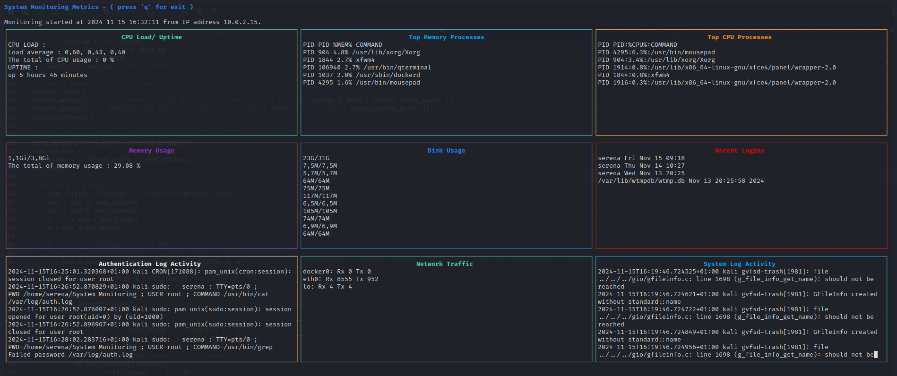

# El-Doctor Project

**Project objective**
One of the most important responsibilities a system administrator or SOC analyst have is monitoring the systems he manages. The objective of the project is to create your own monitoring script.

## Documentation of the scripts
    
## **Bash script - monitoring.sh**

### Overview

This script collects and monitors various system metrics such as CPU usage, memory utilization, disk usage, network traffic, and log activities. The collected data is stored in CSV files for further analysis. Additionally, the script includes a mechanism to detect critical system states (high CPU or memory usage) and send email alerts.

---

### Features

#### Metrics Collected
- **CPU Load and Uptime:** Captures the system's load averages and uptime.
- **Top CPU Processes:** Lists the top processes sorted by CPU usage.
- **Top Memory Processes:** Lists the top processes sorted by memory usage.
- **Memory Usage:** Reports the current and total memory usage.
- **Disk Usage:** Displays disk utilization for all mounted devices.
- **Recent Logins:** Logs details of the three most recent user logins.
- **Authentication Log Activity:** Captures the last 10 entries from the authentication log (`/var/log/auth.log`).
- **System Log Activity:** Captures the last 10 entries from the system log (`/var/log/syslog`).
- **Network Traffic:** Summarizes data received and transmitted over specific interfaces.

#### Critical State Detection
- Triggers an email alert when:
  - CPU usage exceeds 90%.
  - Memory usage exceeds 80%.

#### Output Files
- Metrics are stored in individual CSV files:
  - `date_ip.csv`: Date and system IP address.
  - `cpu_load.csv`: CPU load and uptime.
  - `memory_process.csv`: Top memory-consuming processes.
  - `cpu_process.csv`: Top CPU-consuming processes.
  - `memory_usage.csv`: Memory usage details.
  - `disk_usage.csv`: Disk usage details.
  - `recent_logins.csv`: Recent login activity.
  - `auth_log_activity.csv`: Authentication logs.
  - `network_traffic.csv`: Network traffic summary.
  - `sys_log_activity.csv`: System logs.

---

### Prerequisites

- **Shell:** Compatible with `bash`.
- **Utilities Used:**
  - `ps`, `top`, `uptime`, `awk`, `free`, `df`, `last`, `tail`, `netstat`, `hostname`.
- **Mail Setup:** Configure `mail` utility for sending email alerts.
- **Permissions:** Root privileges may be required for accessing some system logs.

**Mail alert setup:**
 
1. In Google settings > Manage your google account > Security > 2-step validation > app password: create a token
2. sudo apt install postfix
3. sudo nano /etc/postfix/main.cf and add these lines :
    
    myorigin = /etc/mailname
    #gmail
    relayhost = [smtp.gmail.com]:587
    smtp_use_tls = yes
    smtp_tls_security_level = may
    smtp_sasl_auth_enable = yes
    smtp_sasl_password_maps = hash:/etc/postfix/sasl_passwd
    smtp_sasl_security_options = noanonymous
    smtp_tls_CAfile = /etc/ssl/certs/ca-certificates.crt

4. cd /etc/postfix
    sudo touch sasl_passwd 
    sudo nano sasl_passwd and write this line :

    [smtp.gmail.com]:587    your_email@gmail.com:your_password  

    (The password is the token retrieved from gmail in step 1.)
5. sudo systemctl start postfix  
6. sudo systemctl enable postfix  
7. test with this command : echo "Testing" | mail -s 'test' useremailadress@gmail.com

---

### Automating Execution with a Cron Job

To ensure this monitoring script runs automatically every hour, you can schedule it using a cron job. Cron is a Linux utility that automates the execution of scripts or commands at specified intervals. Below are the steps to set up the script as a cron job:

#### Steps to Create a Cron Job

1. Open the crontab editor: `crontab -e`
2. Add the following line to schedule the script to run every hour: `0 * * * * /path/to/monitoring.sh`
3. Verify the cron job is added by listing the crontab entries: `crontab -l`

## **System Monitoring Metrics Interface - monitoring_interface.py**

This Python script provides a curses-based terminal interface to display various system monitoring metrics. It retrieves data from CSV files, organizes it into blocks, and uses colors for better readability.

### Features

- **Dynamic Interface**: Displays metrics in organized blocks with borders and colored titles.
- **Metrics Displayed**:
  - **CPU Load & Uptime**
  - **Top Memory Processes**
  - **Top CPU Processes**
  - **Memory Usage**
  - **Disk Usage**
  - **Recent Logins**
  - **Authentication Log Activity**
  - **Network Traffic**
  - **System Log Activity**
- **Automatic File Reading**: Reads metrics from CSV files dynamically.
- **Exit Option**: Press `'q'` to exit the interface.
- **Resizable Windows**: Adjusts to terminal size.

---

## Usage

Run the script with this command : `./monitoring_interface.py`

---

## Example Screenshot

